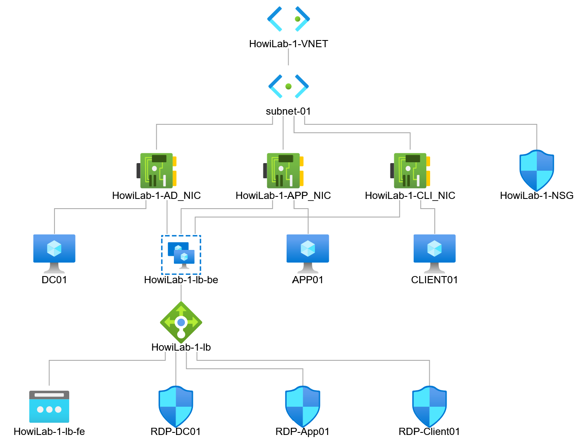

# HowiLab

---

## Schulungs-, Demo-, Testumgebung in Azure

Du benötigst hin und wieder eine Testumgebung bestehend aus einem DC, einem Client und einem Server zu Schulungszwecken, selbstlernen oder experimentieren? Das ganze in Azure?

Microsoft hat dazu Test Lab Guides veröffentlicht. [Simulated Enterprise Base Configuration](https://docs.microsoft.com/en-us/microsoft-365/enterprise/simulated-ent-base-configuration-microsoft-365-enterprise). Auch ein [Github Repository](https://github.com/maxskunkworks/TLG/tree/master/tlg-base-config_3-vm.m365-ems) mit ARM Templates ist vorhanden, welches aber nicht mehr weiterentwickelt wird. Diese Templates dienen mir als Ausgangspunkt für meine angepasste Testumgebung.

### VMs

Ich wähle als Betriebssystem für die Server den Windows Server 2019 Datacenter und den Windows 11 Client 23h2. Die Machine Size für alle ist "Standard_D2s_v3" mit 2 CPU Kernen und 8 GB RAM. Aus Kostengründen nehme ich die smalldisk-Images für dir Server in Azure. Es werden Managed Disks für die OS-Disks und Data-Disks benutzt, so dass man keinen Storage Account braucht.
Anders als bei den Originaltemplates, wo alle Maschinen eine öffentliche IP bekommen und direkt per RDP über Port 3389 erreichbar sind, erstellt mein Template eine öffentliche Standard IP und einen Standard Load Balancer. Die VMs sind im Backend Pool des Load Balancers und per Inbound NAT rules wird der Zugriff per RDP über Custom Ports geregelt.

Die Konfiguration erfolgt durch die Desired State Configuration (DSC) Erweiterung:

- **DC01** ist der Domänencontroller der Domäne *corp.howilab.local*.
  - IP-Adresse: 10.0.0.10 (statisch)
  - Der Domänen-Benutzer *user1* wird erstellt und der Gruppe Domänen-Admins hinzugefügt
  - Eine OU-Struktur, globale Gruppen und Benutzer werden erstellt
  - DSC-Module: xActiveDirectory, xNetworking, xDisk, cDisk
- **App01** ist ein Mitgliedsserver der Domäne
  - IP-Adresse: 10.0.0.21 (statisch)
  - IIS und .NET 4.5 wird installiert
  - Der Ordner c:\\files wird als "\\\\App01\\files" freigegeben. *user1* bekommt Vollzugriff
  - DSC-Module: xDisk, cDisk, xSmbShare, cNtfsAccessControl
- **Client01** ist ebenfalls Domänenmitglied.
  - IP-Adresse: 10.0.0.50 (statisch)
  - Über die globale Gruppe EWS bekommen alle Benutzer RDP Zugriff
  - DSC-Module: cDisk, xDisk
  
Im Ordner *scripts* befindet sich das Powershell Skript *Deploy.ps1*, welches zunächst heruntergeladen werden sollte. Die Variablen darin lassen sich an die eigenen Bedürfnisse anpassen. Dann benötigt man natürlich eine Azure Subscription, um die Umgebung bereitzustellen.

Wer es lieber mit dem Azure Portal versuchen will klickt hier:

